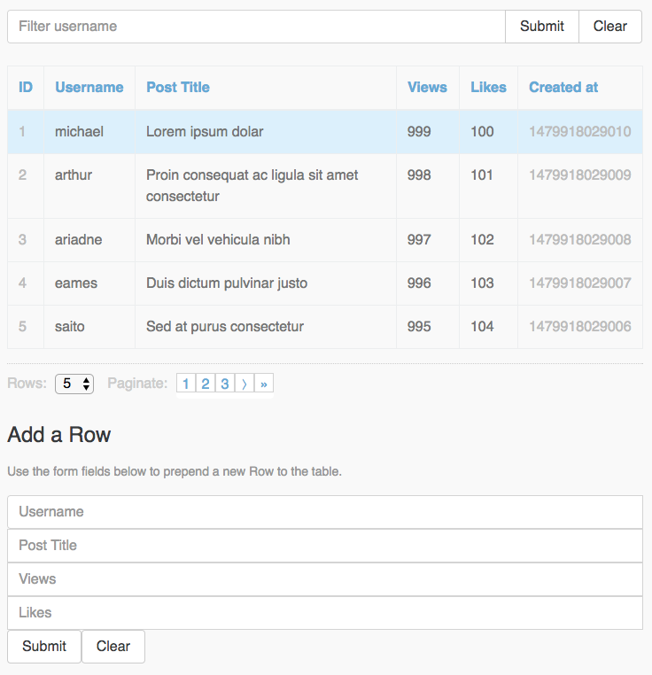

# react-redux-table-demo

> A WIP React/Redux Table App Demo to fulfill all your hopes and dreams.

**Live Demo:** [https://radiovisual.github.io/react-redux-table-demo/](https://radiovisual.github.io/react-redux-table-demo/)

## Screenshot

Below is a screenshot showing off some of the demoed features: Username filtering, sorting by each column,
custom row count values, `activeUser` row is highlighted, pagination, adding a new row, etc...

## TODO

- [ ] Bug: sometimes must double-click to get column to sort
- [ ] Tests!
- [ ] Filter by username should be more robust
- [ ] Add support for persisted state

## License

MIT